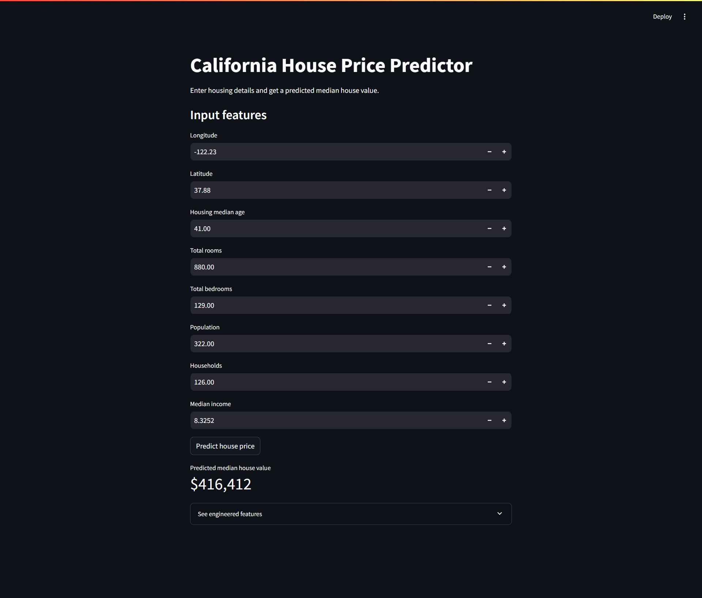

# House Price Prediction (Machine Learning Project)

## Overview
This project builds a machine learning model to predict California housing prices using the California Housing dataset.

The goal is to demonstrate a full data science workflow including:

- Data exploration (EDA)
- Feature engineering
- Model training
- Model comparison
- Model evaluation

## Live Demo

Try the deployed app here:

[https://house-price-prediction-princeyv.streamlit.app
](https://house-price-prediction-princeyv.streamlit.app/)

## Dataset

California Housing Dataset

Source:
https://raw.githubusercontent.com/ageron/handson-ml/master/datasets/housing/housing.csv

Features include:

- median_income
- housing_median_age
- total_rooms
- total_bedrooms
- population
- households
- latitude
- longitude

Target variable:

median_house_value

## Feature Engineering

New features were created to improve model performance:

- rooms_per_household
- bedrooms_per_room
- population_per_household

These features capture housing density and living conditions.

## Models Tested

Three models were trained and evaluated.

| Model | RMSE |
|------|------|
| Linear Regression | 68,311 |
| Decision Tree | 70,442 |
| Random Forest | **50,709** |

Random Forest produced the best results.

## Key Findings

Important predictors of house prices:

- Median income (strongest feature)
- Geographic location (latitude / longitude)
- Population density
- Housing age

Higher-income areas and coastal locations tend to have higher house prices.

## Technologies Used

- Python
- Pandas
- NumPy
- Scikit-learn
- Matplotlib
- Jupyter Notebook

## Project Structure

```
HOUSEPROJECT
│
├── .venv
├── .vscode
├── assets
│   └── app_demo.png
│
├── data
│   └── housing.csv
│
├── HouseProject/models
│   └── model_results.csv
│
├── models
│   ├── model_results.csv
│   └── random_forest_housing.pkl
│
├── notebooks
│   └── eda.ipynb
│
├── house_price_prediction.ipynb
├── housing.csv
├── streamlit_app.py
├── README.md
├── requirements.txt
```
## App Demo

This project also includes a Streamlit app where users can enter housing features and get a predicted median house value.
Below is the Streamlit application used to predict house prices.



Run locally with:

```bash
streamlit run streamlit_app.py
